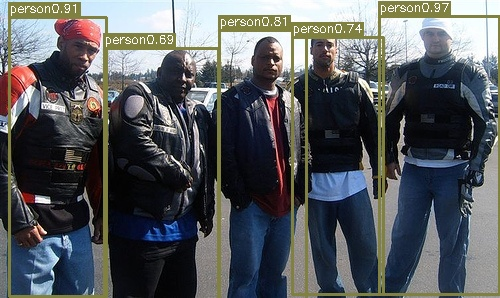

# yolo v1_pytorch
## 项目目录
```text
｜--checkpoints          日志和权重
    |--log.txt
    |--best.pth
｜--datasets             数据集
    |--images.txt
    |--voc2007.txt
    |--voc2012.txt
    |--voc2007test.txt
    |--images/
        |--XXXX.jpg
        |--...
｜--imgs                 测试图片
    |--person.jpg
｜--models               模型
    |--resnet_yolo.py
    |--vgg_yolo.py
    |--yoloLoss.py         
｜--utils                工具
    |--dataset.py
    |--piplist2equal.py
    |--xml2txt.py
｜--train.py
｜--predict.py
｜--eval_voc.py
｜--requirements.txt 环境


```

## 1. 环境准备
详细内容参考[requirements.txt](requirements.txt)

## 2. 数据集准备
**下载数据集**   
链接: https://pan.baidu.com/s/1hturxvztlt_ePnZt3TTzWQ  密码: 6qgn  

**解压数据集**   
1、将voc2007和voc2012的所有图片放到`datasets/images`目录下。  

2、然后使用`utils/xml2txt.pyt`将xml文件转成txt格式。此步骤结果已经保存，可省略。

## 3.训练
```shell
python train.py
```
## 4.预测
```text
python predict.py
```
## 5.计算mAP
```text
python eval_voc.py
```



## 附
对于初学者或硬件条件限制问题，提供训练后的权重.pth文件。

【获取方式】 
关注公众号 【OAOA】，回复【0813】获取百度盘链接。

## 参考
原项目地址：https://github.com/FelixFu520/yolov1